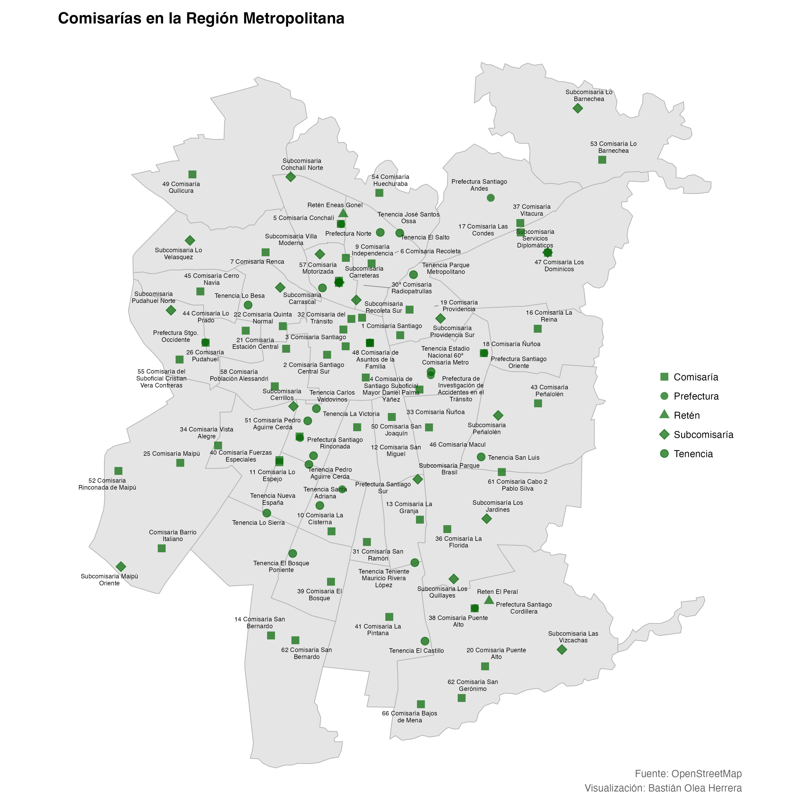
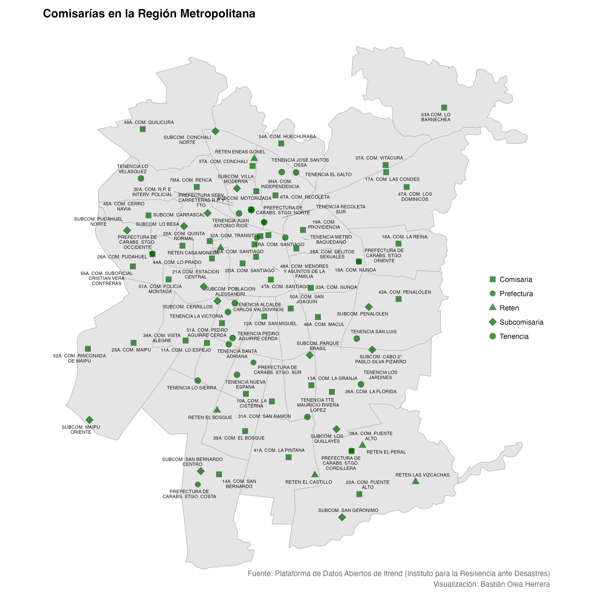

## Comisarías de Chile

Base de datos con comisarías y otras instalaciones de Carabineros.

La idea de este repo es obtener una tabla de datos con la ubicación geográfica de todas las comisarías de Chile.

Se usaron dos fuentes de datos: OpenStreetMap, y la Plataforma de Datos Abiertos de Itrend (Instituto para la Resiliencia ante Desastres).

Los datos de OpenStreetMap son un poco más complejos de obtener, por lo que solo están acá para la RM. Además, las comunas que reportan no son 100% certeras. Habría que sacar las columnas por medio de las coordenadas. Por otro lado, los datos de Itrend vienen perfectamente ordenados para todo el país, lo que resulta más conveniente.

La base de datos de OpenStreetMap contiene 221 comisarías con nombre, comuna, clase (si es tenencia, comisaría, subcomisaría, retén, o prefectura), y columnas con la ubicación geográfica de las comisarías.

La base de Itrend contiene 929 cuarteles con nombre, comuna, región, provincia (todas con sus códigos únicos territoriales), columna de geografía y columnas de longitud y latitud.

Recomiendo usar la base de Itrend, que pueden obtener desde acá: https://www.plataformadedatos.cl

Respecto a la información geográfica de las comisarías de OpenStreetMap, el archivo `comisarias.rds` contiene la columna `geometry`, que puede ser punto, polígono o multipolígono, mientras que el archivo `comisarias.csv` solo contiene la latitud y longitud.

## Fuentes
- OpenStreetMap
- [Plataforma de Datos Abiertos de Itrend](https://www.plataformadedatos.cl) (Instituto para la Resiliencia ante Desastres). Carabineros de Chile, «Cuarteles de Carabineros». Obtenida a través de la Plataforma de Datos Abiertos de Itrend.